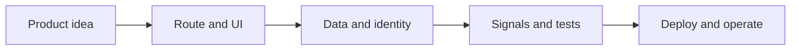

# Ryvax.js — Full-stack TypeScript framework

Ryvax.js is an open-source **React-first full-stack TypeScript framework** for building production web applications and deterministic APIs with file-based routing, React SSR and SSG, client hydration, streaming, authentication, jobs, caching, observability, and portable Node.js deployment.

---

## Orientation

> **A practical map** — Choose a path through Ryvax by the kind of system you are building, not by the order of the navigation.

A mental map from first install to production operations.

### Key concepts

<Columns cols={3}>
  <Card title="First question" icon="sparkles">
    What is the smallest valuable request?
  </Card>
  <Card title="Second question" icon="shield-check">
    What must remain portable?
  </Card>
  <Card title="Third question" icon="gauge-high">
    How will success be proven?
  </Card>
</Columns>

### Ryvax from first install to production

<Steps titleSize="h3">
  <Step title="Pick a slice" icon="download">
    Start with installation, first app, or the SaaS starter according to your goal.
  </Step>
  <Step title="Learn the runtime" icon="route">
    Read architecture, routing, and API contracts before adding providers.
  </Step>
  <Step title="Add platform weight" icon="database">
    Choose SQL, auth, cache, jobs, storage, or agents only when the slice needs them.
  </Step>
  <Step title="Close the loop" icon="rocket">
    Use benchmarks, release checks, and production guidance to prove the result.
  </Step>
</Steps>

## Choose a track

| Track | Start here | What it proves |
| --- | --- | --- |
| First question | What is the smallest valuable request? | Start with one route and one response. |
| Second question | What must remain portable? | Keep providers behind adapters. |
| Third question | How will success be proven? | Write a contract test and an operational signal. |

<Info>
The roadmap is intentionally kept on this page. The guides below are reference material for a specific engineering decision, not another onboarding sequence.
</Info>

## References

[1]: https://github.com/kvantjs/ryvax.js "Ryvax source repository"
[2]: https://www.npmjs.com/package/@kvantjs/ryvax.js "Ryvax package on npm"
[3]: https://nodejs.org/api/http.html "Node.js HTTP API"
[4]: https://developer.mozilla.org/en-US/docs/Web/API/AbortSignal "AbortSignal Web API"
[5]: https://react.dev/reference/react-dom/server "React server rendering APIs"
[6]: https://www.typescriptlang.org/docs/handbook/intro.html "TypeScript handbook"
